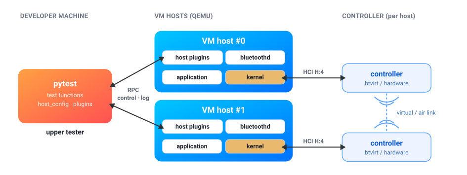

pytest-bluezenv
===============

**pytest-bluezenv** is a `pytest <https://pytest.org>`_ plugin for
functional testing of the Linux Bluetooth stack and applications.

- Source code: https://github.com/bluez/pytest-bluezenv/
- Documentation: https://bluez.github.io/pytest-bluezenv/
- PyPi: https://pypi.org/project/pytest-bluezenv/

A test declares the plugins for each VM host. pytest-bluezenv starts the VM
hosts and exposes them through RPC. VM hosts communicate through emulated
``btvirt`` controllers by default, or through passed-through USB or PCIe
controllers.

.. toctree::
   :maxdepth: 2
   :caption: Contents:

   overview
   writing_tests
   running_tests
   api
   options
   requirements
   releases
